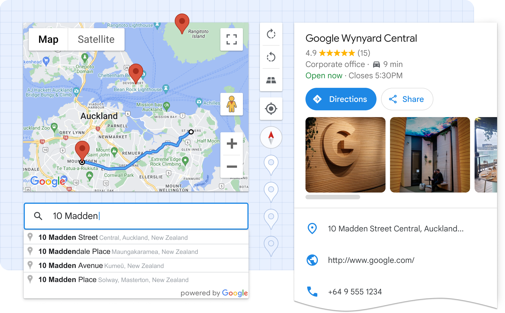

# Extended Component Library

Google Maps Platform’s Extended Component Library is a set of Web Components that helps developers build better maps faster, and with less effort. It encapsulates boilerplate code, best practices, and responsive design, reducing complex map UIs into what is effectively a single HTML element.  

Ultimately, these components make it easier to read, learn, customize, and maintain maps-related code.



## Installation

### Loading the library

#### For applications that bundle their code

For best performance, use a package manager and import only the components you need. This package is listed on NPM as 
[@googlemaps/extended-component-library](https://www.npmjs.com/package/@googlemaps/extended-component-library). Install it with:

```bash
npm i @googlemaps/extended-component-library
```

Then import any components you use in your application:

```js
import '@googlemaps/extended-component-library/overlay_layout.js';
```

#### To load all components

Alternatively, we provide a CDN-hosted bundle that you can include directly in your HTML file as a [module script](https://developer.mozilla.org/en-US/docs/Web/JavaScript/Guide/Modules#applying_the_module_to_your_html):

```html
<script type="module" src="https://unpkg.com/@googlemaps/extended-component-library"></script>
```

When using the CDN-hosted bundle, all components are available globally, and don’t require further imports. *Please note that unpkg is unaffiliated with Google Maps Platform and using their CDN may come with its own terms and expectations.*

### Getting your API key

The components in this library make use of Google Maps Platform APIs. To start, you'll need to [sign up for Google Maps Platform and create an API key](https://console.cloud.google.com/google/maps-apis/start?utm_source=github&utm_medium=documentation&utm_campaign=&utm_content=web_components). Then, place an API Loader element somewhere in the root of your app's HTML, specifying your API key:

```html
<gmpx-api-loader key="YOUR_API_KEY"></gmpx-api-loader>
```

When you sign up, by default, all APIs will be enabled, but you can opt to enable only the APIs needed for each component by referencing the “APIs and pricing" section in that component's documentation. 

## Usage

This library contains a set of [Web Components](https://developer.mozilla.org/en-US/docs/Web/Web_Components), usable anywhere in the HTML of your web app. Web components are supported in all modern browsers and expose a framework-agnostic mechanism for encapsulating UI and functionality.

This example shows how to display information about a particular place, purely in HTML:

```html
<!-- Please note unpkg.com is unaffiliated with Google Maps Platform -->
<script type="module" src="https://unpkg.com/@googlemaps/extended-component-library"></script>

<!-- Configure and load the Maps JS SDK with your API key -->
<gmpx-api-loader key="YOUR_API_KEY"></gmpx-api-loader>

<gmpx-split-layout>
  <gmpx-place-overview slot="fixed" place="ChIJ39Y-tdg1fYcRQcZcBb499do"></gmpx-place-overview>
  <gmp-map slot="main" center="43.880,-103.459" zoom="10" map-id="DEMO_MAP_ID">
    <gmp-advanced-marker position="43.880,-103.459"></gmp-advanced-marker>
  </gmp-map>
</gmpx-split-layout>
```

Web Components are also designed to be used with JavaScript. Here’s an example showing how you can add a pan-to-marker action:

```html
<!-- Please note unpkg.com is unaffiliated with Google Maps Platform -->
<script type="module" src="https://unpkg.com/@googlemaps/extended-component-library"></script>

<!-- Configure and load the Maps JS SDK with your API key -->
<gmpx-api-loader key="YOUR_API_KEY"></gmpx-api-loader>

<gmp-map id="my-map" center="33.15,-96.20" zoom="10" map-id="DEMO_MAP_ID">
  <gmp-advanced-marker class="pannable" position="33.15,-96.20"></gmp-advanced-marker>
  <!-- Some more markers ... -->
</gmp-map>

<script>
window.addEventListener('load', () => {
  const mapElement = document.getElementById('my-map');
  const markers = document.querySelectorAll('gmp-advanced-marker.pannable');
  markers.forEach((marker) => {
    marker.addEventListener('gmp-click', () => {
      mapElement.innerMap.panTo(marker.position);
    });
  });
});
</script>
```

### Frameworks

Web Components work well with most popular frontend frameworks such as Angular, React, or Vue.js. Refer to your framework’s documentation for instructions on how to use custom elements.

## Components available with Maps JS SDK

Map and marker components can be used with the Extended Component Library, or on their own.

| Component               | Description                                    |
| ----------------------- | ---------------------------------------------- |
| `<gmp-map>`             | The map component displays a map on a webpage, and can wrap other map-related components such as markers inside the map component in HTML. |
| `<gmp-advanced-marker>` | The marker component displays a pin on the map at specified coordinates. |

## Inventory of components

| Component                                                | Description                                                                                                                                                                                                                           |
| -------------------------------------------------------- | ------------------------------------------------------------------------------------------------------------------------------------------------------------------------------------------------------------------------------------- |
| [`<gmpx-api-loader>`](api_loader/README.md)              | The API loader component loads the Google Maps Platform libraries necessary for Extended Components.                                                                                                                                  |
| [`<gmpx-icon-button>`](icon_button/README.md)            | The icon button component is used for actions in the UI that help users get things done with a single tap. It contains an icon and a text label.                                                                                      |
| [`<gmpx-overlay-layout>`](overlay_layout/README.md)      | The overlay layout component allows you to display information in a responsive panel view that sits on top of main content, like a map or a list. You might use this to show a modal dialog, more details about a place, or settings. |
| [`<gmpx-place-overview>`](place_overview/README.md)      | The place overview component displays detailed information about millions of businesses, including opening hours, star reviews, and photos, plus directions and other actions in a premade UI in 5 sizes and formats.                 |
| [`<gmpx-place-picker>`](place_picker/README.md)          | The place picker component is a text input that allows end users to search Google Maps’ global database for a specific address or place using autocomplete.                                                                           |
| [`<gmpx-split-layout>`](split_layout/README.md)          | The split layout component allows you to display custom HTML information in a responsive panel view alongside main content. In a narrow container, such as a mobile viewport, the panel will be shown below the main content.         |
| [Place building blocks](place_building_blocks/README.md) | The place data provider component, along with individual place details components, lets you choose how to display Google Maps place information like opening hours, star reviews, and photos in a new, custom view.                   |

## Styling and theming

To change the look and feel of components, you’ll use [CSS custom properties](https://developer.mozilla.org/en-US/docs/Web/CSS/--*). Each component’s documentation will indicate which CSS custom properties it supports for styling.

For example, the Place Picker component exposes the `--gmpx-color-surface` property to adjust the background color of the text input. You could use the following CSS to set this color to blue for all Place Pickers on the page:

```css
body {
  --gmpx-color-surface: blue;
}
```

Global theming options let you consistently customize the color and typography for components in your application. You can choose a font and color scheme to match your brand, or default to the look of Google Maps. These are available as *global style tokens*, applicable across multiple components. This table lists the global style tokens used in the library: these are a good starting point to consistently adjust the look and feel of components on your page.

| CSS custom property                 | Default         | Description           | 
| ----------------------------------- | --------------- | --------------------- |
| `--gmpx-color-surface`              | `#fff`          | Surface theme color, used as a background. |
| `--gmpx-color-on-surface`           | `#212121`       | Color used for text and other elements placed on top of the surface color. |
| `--gmpx-color-on-surface-variant`   | `#757575`       | Color used for supporting metadata and other elements placed on top of the surface color. |
| `--gmpx-color-primary`              | `#1e88e5`       | Primary theme color used for interactive text and elements, like buttons and icons. Also used to highlight an active or selected state like in a focused text field’s border. |
| `--gmpx-color-on-primary`           | `#fff`          | Color used for text or icons on top of a `--gmpx-color-primary` background. |
| `--gmpx-font-family-base`           | `'Google Sans Text', sans-serif` | Typeface for body text, captions, and labels. |
| `--gmpx-font-family-headings`       | `'Google Sans Text', sans-serif` | Typeface for headings. |
| `--gmpx-font-size-base`             | `0.875rem`      | Baseline font size, from which other text elements in a component are scaled. For most users with default settings, this will be 14px. |

## Terms of Service

The Extended Component Library uses Google Maps Platform services, and any use of Google Maps Platform is subject to the [Terms of Service](https://cloud.google.com/maps-platform/terms?utm_source=github&utm_medium=documentation&utm_campaign=&utm_content=web_components).

For clarity, the Extended Component Library, and each underlying component, is not a Google Maps Platform Core Service. 

## Attribution

As a reminder, you must comply with all applicable attribution requirements for the Google Maps Platform API(s) and SDK(s) used by the Extended Component Library.

## Support

This library is community supported, with sponsorship from Google to maintain and ensure a base level of quality. It is not governed by the Google Maps Platform [Technical Support Services Guidelines](https://cloud.google.com/maps-platform/terms/tssg?utm_source=github&utm_medium=documentation&utm_campaign=&utm_content=web_components).

Google will make efforts to support the public and protected surface of the library and maintain backwards compatibility in the future; however, while the library is in version 0.x, Google reserves the right to make backwards-incompatible changes. If Google does remove some functionality (typically because better functionality exists or if the feature proved infeasible), the intention is to deprecate the functionality and give developers adequate time to update their code.


