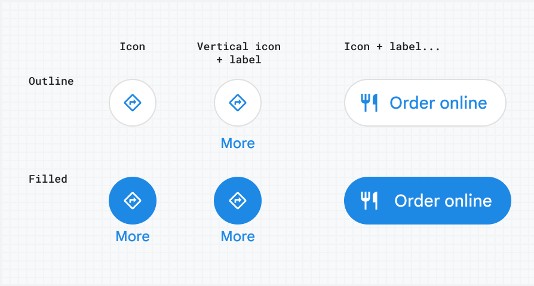

[Extended Component Library](../../README.md)

# Icon Button: `<gmpx-icon-button>` (as class `IconButton`)

The icon button component is used for actions in the UI that help users get
things done with a single tap. It contains an icon and a text label.

This element is designed to be visually consistent when used with other
components in the Extended Component Library. For example, Icon Buttons can
be used in the `action` slot of the [Place
Overview](../place_overview/README.md) component to provide a consistent look
and feel.



## Importing

When loading the library with a &lt;script&gt; tag (referencing the CDN bundle), please refer to the instructions in the root-level Readme. You do not need to take additional steps to use this component.

When bundling your dependencies and you want to include `<gmpx-icon-button>` on a page:

```
import '@googlemaps/extended-component-library/icon_button.js';
```

When bundling your dependencies and you need to access the class `IconButton` directly (less common):

```
import { IconButton } from '@googlemaps/extended-component-library/icon_button.js';
```

## Attributes and properties

| Attribute       | Property       | Property type                                                         | Description                                                                                                                                                                                                                                                                                                                                   | Default      | [Reflects?](https://open-wc.org/guides/knowledge/attributes-and-properties/#attribute-and-property-reflection) |
| --------------- | -------------- | --------------------------------------------------------------------- | --------------------------------------------------------------------------------------------------------------------------------------------------------------------------------------------------------------------------------------------------------------------------------------------------------------------------------------------- | ------------ | -------------------------------------------------------------------------------------------------------------- |
| `aria-haspopup` | `ariaHasPopup` | `'true'\|'dialog'\|'menu'\|'listbox'\|'tree'\|'grid'\|       'false'` | Indicates the availability and type of interactive popup element that can be triggered by the button. See: https://developer.mozilla.org/en-US/docs/Web/Accessibility/ARIA/Attributes/aria-haspopup.<br/><br/>This attribute has no effect when `href` is set.                                                                                | `'false'`    | ✅                                                                                                              |
| `aria-label`    | `ariaLabel`    | `string\|null`                                                        | A description that gets read by assistive devices. In the case of icon-only buttons, you should always include an ARIA label for optimal accessibility.                                                                                                                                                                                       | `null`       | ✅                                                                                                              |
| `condensed`     | `condensed`    | `boolean`                                                             | Whether to render the button in a condensed layout, where the label appears below the icon.                                                                                                                                                                                                                                                   | `false`      | ✅                                                                                                              |
| `href`          | `href`         | `string \| undefined`                                                 | Set this attribute to a URL to have the Icon Button open it in a new tab, when clicked. Alternatively, specify on-click behavior for this component by attaching an event listener.<br/><br/>Per accessibility best practice, the component will render its content inside an `<a>` instead of `<button>` element when this attribute is set. |              | ✅                                                                                                              |
| `icon`          | `icon`         | `string \| undefined`                                                 | Name of icon from [Material Symbols Set](https://fonts.google.com/icons) to display before the button label.<br/><br/>If icon is unspecified, then a "+" icon will be rendered by default. This default icon is omitted if button has a label or other content and is not in condensed layout.                                                |              | ✅                                                                                                              |
| `variant`       | `variant`      | `'outlined'\|'filled'`                                                | Specifies the display style of the button.                                                                                                                                                                                                                                                                                                    | `'outlined'` | ✅                                                                                                              |

## Slots

| Slot name   | Description                               |
| ----------- | ----------------------------------------- |
| *(default)* | Content to display as the button’s label. |

## Styling

You can use most built-in CSS properties to control the positioning or display of this component, similar to a `<span>` or `<div>` element. The component also supports the following styling inputs for more customization:

### CSS Custom Properties

| Name                          | Default                          | Description                                                                                          |
| ----------------------------- | -------------------------------- | ---------------------------------------------------------------------------------------------------- |
| `--gmpx-color-primary`        | `#1976d2`                        | Button text and outline color in the `outlined` variant, or background color in `filled` variant. 🌎 |
| `--gmpx-color-on-primary`     | `#fff`                           | Button text color in `filled` variant. 🌎                                                            |
| `--gmpx-color-outline`        | `#e0e0e0`                        | Outline color. 🌎                                                                                    |
| `--gmpx-font-size-base`       | `0.875rem`                       | Font size for the button. 🌎                                                                         |
| `--gmpx-font-family-headings` | `--gmpx-font-family-base`        | Font face for the button, except for condensed mode. 🌎                                              |
| `--gmpx-font-family-base`     | `'Google Sans Text', sans-serif` | Font face used when the button is in condensed mode. 🌎                                              |

🌎 _indicates a global style token shared by
                                    multiple components. Please see the library
                                    Readme for more information._


## Examples

### Display an icon button

You can use an Icon Button just like a typical HTML `<button>` element:

```html
<gmpx-icon-button icon="takeout_dining" variant="filled" id="order-button">
  Begin order
</gmpx-icon-button>
```

Then, attach an event listener to the button using JavaScript:

```js
document.getElementById("order-button").addEventListener("click", () => beginOrderFlow());
```


