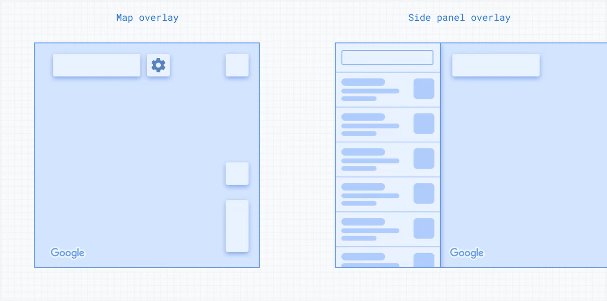

[Extended Component Library](../../README.md)

# Overlay Layout: `<gmpx-overlay-layout>` (as class `OverlayLayout`)

The overlay layout component allows you to display information in a
responsive panel view that sits on top of main content, like a map or a list.
You might use this to show a modal dialog, more details about a place, or
settings.

This component helps manage keyboard focus when opening and closing the
overlay.

The size of the gmpx-overlay-layout can be set directly with the `width` and
`height` properties. If none are provided, it will fill the size of its
containing element.



**To use this component, you'll need to specify `slot="main"` or
`slot="overlay"` on its children.** Read more on using slots
[here](https://developer.mozilla.org/en-US/docs/Web/API/Web_components/Using_templates_and_slots#adding_flexibility_with_slots).

## Importing

When loading the library with a &lt;script&gt; tag (referencing the CDN bundle), please refer to the instructions in the root-level Readme. You do not need to take additional steps to use this component.

When bundling your dependencies and you want to include `<gmpx-overlay-layout>` on a page:

```
import '@googlemaps/extended-component-library/overlay_layout.js';
```

When bundling your dependencies and you need to access the class `OverlayLayout` directly (less common):

```
import { OverlayLayout } from '@googlemaps/extended-component-library/overlay_layout.js';
```

## Slots

This component uses [named slots](https://developer.mozilla.org/en-US/docs/Web/API/Web_components/Using_templates_and_slots#adding_flexibility_with_slots) to accept custom content. To place content in a named slot, set the content as an HTML child of `<gmpx-overlay-layout>` and add the attribute `slot="SLOT_NAME"` to it.

| Slot name | Description                                                              |
| --------- | ------------------------------------------------------------------------ |
| main      | Main content, displayed by default.                                      |
| overlay   | Overlay content that replaces the main content when the panel is opened. |

## Methods

### `showOverlay()`

Opens the overlay panel.

If focus is currently in the main content, the focused element will be
saved to regain focus when closing the overlay. Focus will then move to
the element in the overlay slot with autofocus, if present. If no element
has autofocus, the internal overlay container will be focused so that
pressing Tab will focus the first interactive element in the overlay slot.

Overlay content will be scrolled to the top, if the panel was previously
opened and scrolled down.

### `hideOverlay()`

Closes the overlay panel.

If focus is currently in the overlay content, focus will move to the last
focused main element, if this was saved when opening the panel. If no
focused element was saved, the internal main container will be focused
so that pressing Tab will focus the first interactive element in the main
slot.


## Examples

### Using an overlay to show more information

An overlay layout is useful to show more details about a particular location. In this example, a UX panel shows a list of places. When a user clicks on one of them, the overlay opens and displays more information about it.

```html
<gmpx-overlay-layout id="layout" style="width: 100%; height: 20em; border: 1px solid black;">
  <ul slot="main">
    <li><button data-place-id="ChIJxeyK9Z3wloAR_gOA7SycJC0">Yosemite National Park</button></li>
    <li><button data-place-id="ChIJVVVVVVXlUVMRu-GPNDD5qKw">Yellowstone National Park</button></li>
    <li><button data-place-id="ChIJFU2bda4SM4cRKSCRyb6pOB8">Grand Canyon National Park</button></li>
  </ul>

  <div slot="overlay">
    <button id="overlay-close" autofocus>Go back</button>
    <gmpx-place-overview id="overlay-overview"></gmpx-place-overview>
  </div>
</gmpx-overlay-layout>
```

Some basic JavaScript is required to implement the open and close actions:

```js
const overlayLayout = document.getElementById("layout");
const placeOverview = document.getElementById("overlay-overview");
const closeButton = document.getElementById("overlay-close");

// Trigger the overlay to open when a user clicks on a list item.
document.querySelectorAll("li > button").forEach((item) => {
  item.addEventListener("click", () => {
    placeOverview.place = item.dataset.placeId;
    overlayLayout.showOverlay()
  });
});

// Implement a close button on the overlay.
closeButton.addEventListener("click", () => {overlayLayout.hideOverlay()});
```


