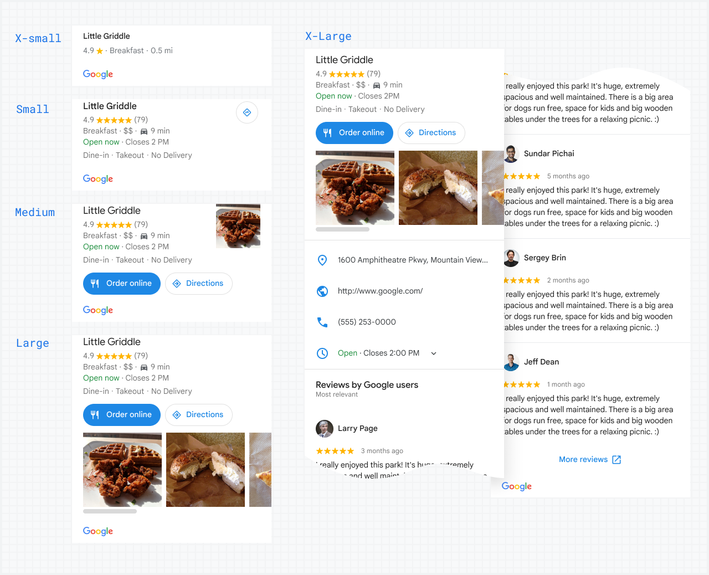

[Extended Component Library](../../README.md)

# Place Overview: `<gmpx-place-overview>` (as class `PlaceOverview`)

The place overview component displays detailed information about millions of
businesses, including opening hours, star reviews, and photos, plus
directions and other actions in a premade UI in 5 sizes and formats.

This component can fetch Place data from the GMP Place API, or forward Place
data provided elsewhere in code. The component may attempt to locally cache
Place data to avoid redundant API requests.

(x-large version) Reviews are displayed in an order corresponding to the
default behavior of the [Place
API](https://developers.google.com/maps/documentation/javascript/reference/place?utm_source=github&utm_medium=documentation&utm_campaign=&utm_content=web_components#Place).



The easiest way to use this component is to start with a Place ID, which can
be retrieved from various Google Maps APIs or [looked up
directly](https://developers.google.com/maps/documentation/javascript/examples/places-placeid-finder?utm_source=github&utm_medium=documentation&utm_campaign=&utm_content=web_components).

This component is designed to display any provided buttons for custom
actions, such as a [directions
button](../place_building_blocks/place_directions_button/README.md) or [icon
button](../icon_button/README.md). **Be sure to include `slot="action"` on
the button components to be shown in the actions row.**

## Importing

When loading the library with a &lt;script&gt; tag (referencing the CDN bundle), please refer to the instructions in the root-level Readme. You do not need to take additional steps to use this component.

When bundling your dependencies and you want to include `<gmpx-place-overview>` on a page:

```
import '@googlemaps/extended-component-library/place_overview.js';
```

When bundling your dependencies and you need to access the class `PlaceOverview` directly (less common):

```
import { PlaceOverview } from '@googlemaps/extended-component-library/place_overview.js';
```

## Attributes and properties

| Attribute                       | Property                     | Property type                                      | Description                                                                                                                                                                                                                                                                                                                                                                                                                                                                                                                                                                                                                                                                                                                                | Default     | [Reflects?](https://open-wc.org/guides/knowledge/attributes-and-properties/#attribute-and-property-reflection) |
| ------------------------------- | ---------------------------- | -------------------------------------------------- | ------------------------------------------------------------------------------------------------------------------------------------------------------------------------------------------------------------------------------------------------------------------------------------------------------------------------------------------------------------------------------------------------------------------------------------------------------------------------------------------------------------------------------------------------------------------------------------------------------------------------------------------------------------------------------------------------------------------------------------------ | ----------- | -------------------------------------------------------------------------------------------------------------- |
| `auto-fetch-disabled`           | `autoFetchDisabled`          | `boolean`                                          | If a `Place` or `PlaceResult` is provided for the `place` property, this component will automatically make API calls to fetch any missing data fields required for display. However, you can set this attribute to prevent the component from making any API calls to fetch missing data. In this case, the component will only display information present in the original `Place` or `PlaceResult` object.                                                                                                                                                                                                                                                                                                                               | `false`     | ✅                                                                                                              |
| `google-logo-already-displayed` | `googleLogoAlreadyDisplayed` | `boolean`                                          | This component displays the Google logo to abide by Google Maps Platform [attribution policies](https://developers.google.com/maps/documentation/places/web-service/policies?utm_source=github&utm_medium=documentation&utm_campaign=&utm_content=web_components#logo). However, if you otherwise satisfy these requirements (e.g. by placing this component on the same screen as a Google Map), you may hide the logo.                                                                                                                                                                                                                                                                                                                                                                                                       | `false`     | ✅                                                                                                              |
| `place`                         | `place`                      | `string\|Place\|PlaceResult \| undefined`          | The place to be displayed by this component. Provide a [Place ID](https://developers.google.com/maps/documentation/places/web-service/place-id?utm_source=github&utm_medium=documentation&utm_campaign=&utm_content=web_components) as a string to have the component look up and display details from the Place API. Alternatively, assign a `Place` or `PlaceResult` object to `place` property to render it directly (note that the attribute, on the other hand, only accepts a Place ID string).                                                                                                                                                                                                                                                                                                                          |             | ❌                                                                                                              |
| `size`                          | `size`                       | `'x-small'\|'small'\|'medium'\|'large'\|'x-large'` | Specifies a variation of this component, from smallest to largest. Larger variations of this component display more data, which may affect cost: - `x-small` size uses [Basic Data](https://developers.google.com/maps/documentation/javascript/place-data-fields?utm_source=github&utm_medium=documentation&utm_campaign=&utm_content=web_components#basic) and [Atmosphere Data](https://developers.google.com/maps/documentation/javascript/place-data-fields?utm_source=github&utm_medium=documentation&utm_campaign=&utm_content=web_components#atmosphere). - All other sizes use [Basic Data](https://developers.google.com/maps/documentation/javascript/place-data-fields?utm_source=github&utm_medium=documentation&utm_campaign=&utm_content=web_components#basic), [Contact Data](https://developers.google.com/maps/documentation/javascript/place-data-fields?utm_source=github&utm_medium=documentation&utm_campaign=&utm_content=web_components#contact), and [Atmosphere Data](https://developers.google.com/maps/documentation/javascript/place-data-fields?utm_source=github&utm_medium=documentation&utm_campaign=&utm_content=web_components#atmosphere). | `'x-large'` | ✅                                                                                                              |
| `travel-mode`                   | `travelMode`                 | `Lowercase<google.maps.TravelMode>`                | Travel mode to be used when computing transit time from `travel-origin`.                                                                                                                                                                                                                                                                                                                                                                                                                                                                                                                                                                                                                                                                   | `'driving'` | ✅                                                                                                              |
|                                 | `travelOrigin`               | `LatLng\|LatLngLiteral\|Place \| undefined`        | If specified, small, medium, large, and extra-large versions will calculate transit time from this location to the current place, then display the result.                                                                                                                                                                                                                                                                                                                                                                                                                                                                                                                                                                                 |             | ❌                                                                                                              |

## Slots

This component uses [named slots](https://developer.mozilla.org/en-US/docs/Web/API/Web_components/Using_templates_and_slots#adding_flexibility_with_slots) to accept custom content. To place content in a named slot, set the content as an HTML child of `<gmpx-place-overview>` and add the attribute `slot="SLOT_NAME"` to it.

| Slot name | Description                                                                                                                                                                                                                                                                                                                             |
| --------- | --------------------------------------------------------------------------------------------------------------------------------------------------------------------------------------------------------------------------------------------------------------------------------------------------------------------------------------- |
| action    | Optionally specify elements to be displayed as actions for this Place. We recommend using `<gmpx-icon-button>` elements for this purpose, which are styled consistently with Place Overview and designed to produce the best result. Note that smaller sizes of Place Overview may suppress the display of some or all action elements. |

## Events

| Name                | React Prop       | Type                | Description                                                                    |
| ------------------- | ---------------- | ------------------- | ------------------------------------------------------------------------------ |
| `gmpx-requesterror` | `onRequestError` | `RequestErrorEvent` | Indicates an error condition in an underlying Google Maps JavaScript API call. |

## Styling

You can use most built-in CSS properties to control the positioning or display of this component, similar to a `<span>` or `<div>` element. The component also supports the following styling inputs for more customization:

### CSS Custom Properties

| Name                              | Default                          | Description                                        |
| --------------------------------- | -------------------------------- | -------------------------------------------------- |
| `--gmpx-color-surface`            | `#fff`                           | Background color. 🌎                               |
| `--gmpx-color-on-surface`         | `#212121`                        | Main text color. 🌎                                |
| `--gmpx-color-on-surface-variant` | `#757575`                        | Color of less important text such as captions. 🌎  |
| `--gmpx-color-primary`            | `#1976d2`                        | Color of buttons and icons. 🌎                     |
| `--gmpx-color-outline`            | `#e0e0e0`                        | Color of divider elements and button outlines. 🌎  |
| `--gmpx-font-family-base`         | `'Google Sans Text', sans-serif` | Font family for regular text. 🌎                   |
| `--gmpx-font-family-headings`     | `--gmpx-font-family-base`        | Font family for headings. 🌎                       |
| `--gmpx-font-size-base`           | `0.875rem`                       | Text size, sets scale for the component. 🌎        |
| `--gmpx-rating-color`             | `#ffb300`                        | Color of star rating icons.                        |
| `--gmpx-rating-color-empty`       | `#e0e0e0`                        | Background color of star rating icons.             |
| `--gmpx-hours-color-open`         | `#188038`                        | Opening hours text color when the place is open.   |
| `--gmpx-hours-color-closed`       | `#d50000`                        | Opening hours text color when the place is closed. |

🌎 _indicates a global style token shared by
                                    multiple components. Please see the library
                                    Readme for more information._


## Examples

### Show information about a specific Place

```html
<gmpx-place-overview place="ChIJN1t_tDeuEmsRUsoyG83frY4">
</gmpx-place-overview>
```

### (Angular) add travel time, directions, and "order now" button

> This example is written for Angular, but can be trivially modified for other frameworks or vanilla JS.

On the Angular component, create and populate a variable `userLocation` to store the end user's location. This value could be set by another component such as `<gmpx-place-picker>`.

Also on the Angular component, create a method `beginOrder()` to define a custom order flow (the Extended Component Library does not provide this action).

Then, in the Angular template, include the following:

```html
<gmpx-place-overview
    place="ChIJN1t_tDeuEmsRUsoyG83frY4"
    size="medium"
    [travelOrigin]="userLocation">
  
  <gmpx-icon-button
      slot="action"
      variant="filled"
      icon="restaurant"
      (click)="beginOrder()">
    Order Online
  </gmpx-icon-button>
  
  <gmpx-place-directions-button
      slot="action"
      [origin]="userLocation">
  </gmpx-place-directions-button>
  
</gmpx-place-overview>
```

### (Vue.js) Show information for an existing `Place` or `PlaceResult`

> This example is written for Vue.js, but can be trivially modified for other frameworks or vanilla JS.

If your app already fetches data from a Places API, you can still use Place Overview to display it.

```html
<gmpx-place-overview :place="myPlaceResult" size="small"> 
</gmpx-place-overview>
```


## APIs and Pricing

In addition to the [Maps JavaScript API](https://developers.google.com/maps/documentation/javascript?utm_source=github&utm_medium=documentation&utm_campaign=&utm_content=web_components), this component relies on the following Google Maps Platform APIs which may incur cost and must be enabled.

### Places API

Used when fetching Places data for the place specified via attribute/property.

#### Documentation

* Fetching Places data:
    * Maps JavaScript API beta version (default): [Place class documentation](https://developers.google.com/maps/documentation/javascript/place?utm_source=github&utm_medium=documentation&utm_campaign=&utm_content=web_components)
    * Maps JavaScript API GA version: [Place details documentation](https://developers.google.com/maps/documentation/javascript/examples/place-details?utm_source=github&utm_medium=documentation&utm_campaign=&utm_content=web_components)
* Displaying Places photos (used in medium, large, and x-large sizes): [Photos documentation](https://developers.google.com/maps/documentation/javascript/places?utm_source=github&utm_medium=documentation&utm_campaign=&utm_content=web_components#places_photos)

Please be sure to check this documentation for additional requirements and recommendations regarding your use.

#### Pricing

Note that the SKUs below (except Place Photo) are not triggered if you provide a `Place` or `PlaceResult` object to this component that contains all the data fields necessary to render its overview content, or if this component has the `auto-fetch-disabled` attribute.

- [SKU: Place Details](https://developers.google.com/maps/billing-and-pricing/pricing?utm_source=github&utm_medium=documentation&utm_campaign=&utm_content=web_components#places-details) (all sizes)
- [SKU: Basic Data](https://developers.google.com/maps/billing-and-pricing/pricing?utm_source=github&utm_medium=documentation&utm_campaign=&utm_content=web_components#basic-data) (all sizes)
- [SKU: Contact Data](https://developers.google.com/maps/billing-and-pricing/pricing?utm_source=github&utm_medium=documentation&utm_campaign=&utm_content=web_components#contact-data) (all sizes except `x-small`)
- [SKU: Atmosphere Data](https://developers.google.com/maps/billing-and-pricing/pricing?utm_source=github&utm_medium=documentation&utm_campaign=&utm_content=web_components#atmosphere-data) (all sizes)
- [SKU: Place Photo](https://developers.google.com/maps/billing-and-pricing/pricing?utm_source=github&utm_medium=documentation&utm_campaign=&utm_content=web_components#places-photo) (all sizes except `x-small` and `small`)

### Directions API

Used when computing travel distance/duration from an origin.

#### Documentation

[Directions API documentation](https://developers.google.com/maps/documentation/javascript/directions?utm_source=github&utm_medium=documentation&utm_campaign=&utm_content=web_components). Please be sure to check this documentation for additional requirements and recommendations regarding your use.

#### Pricing

Note that the SKU below is only triggered if you specify a travel origin, and whenever the origin or travel mode changes.

- [SKU: Directions](https://developers.google.com/maps/billing-and-pricing/pricing?utm_source=github&utm_medium=documentation&utm_campaign=&utm_content=web_components#directions) (all sizes)


