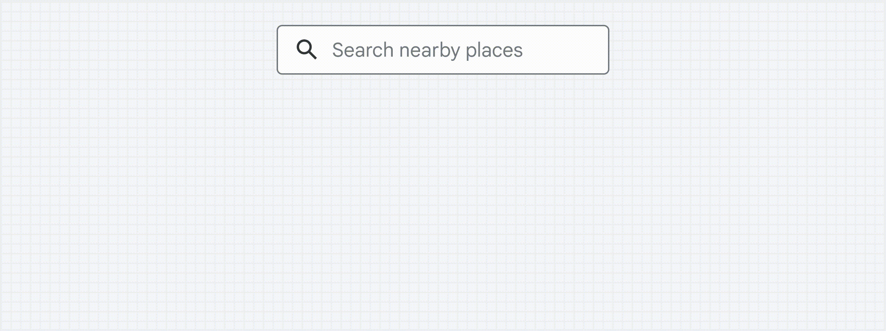

[Extended Component Library](../../README.md)

# Place Picker: `<gmpx-place-picker>` (as class `PlacePicker`)

The place picker component is a text input that allows end users to search
Google Maps’ global database for a specific address or place using
autocomplete.



## Importing

When loading the library with a &lt;script&gt; tag (referencing the CDN bundle), please refer to the instructions in the root-level Readme. You do not need to take additional steps to use this component.

When bundling your dependencies and you want to include `<gmpx-place-picker>` on a page:

```
import '@googlemaps/extended-component-library/place_picker.js';
```

When bundling your dependencies and you need to access the class `PlacePicker` directly (less common):

```
import { PlacePicker } from '@googlemaps/extended-component-library/place_picker.js';
```

## Attributes and properties

| Attribute       | Property       | Property type                            | Description                                                                                                                                                                                                                                                                                                                                                                                                                                        | Default | [Reflects?](https://open-wc.org/guides/knowledge/attributes-and-properties/#attribute-and-property-reflection) |
| --------------- | -------------- | ---------------------------------------- | -------------------------------------------------------------------------------------------------------------------------------------------------------------------------------------------------------------------------------------------------------------------------------------------------------------------------------------------------------------------------------------------------------------------------------------------------- | ------- | -------------------------------------------------------------------------------------------------------------- |
| `country`       | `country`      | `string[] \| undefined`                  | Restricts predictions to up to five countries identified by their ISO 3166-1 Alpha-2 country codes, case insensitive ('us', 'br', 'au', etc.).<br/><br/>Multiple country codes can be specified in the attribute as a set of space-separated tokens (for example, "us ca").                                                                                                                                                                        |         | ✅                                                                                                              |
| `for-map`       | `forMap`       | `string \| undefined`                    | The HTML id of a `<gmp-map>` element on the page that Place Autocomplete should bind to for location biasing. Note that the map need not be a parent of the current element.                                                                                                                                                                                                                                                                       |         | ✅                                                                                                              |
| `location-bias` | `locationBias` | `google.maps.LatLngLiteral \| undefined` | Location of the region to bias predictions towards (or restrict if `strict-bounds` is set), in "lat,lng" format.<br/><br/>This attribute must be used in conjunction with `radius`.                                                                                                                                                                                                                                                                |         | ✅                                                                                                              |
| `placeholder`   | `placeholder`  | `string \| undefined`                    | Placeholder text to display before the user has entered any input.                                                                                                                                                                                                                                                                                                                                                                                 |         | ✅                                                                                                              |
| `radius`        | `radius`       | `number \| undefined`                    | Radius of the region, in meters, to bias predictions towards.<br/><br/>This attribute must be used in conjunction with `location-bias`.                                                                                                                                                                                                                                                                                                            |         | ✅                                                                                                              |
| `strict-bounds` | `strictBounds` | `boolean`                                | If true, only predictions that are within the specified location/radius or map viewport will be returned.<br/><br/>Setting this property to false (which is the default) will make the results biased towards, but not restricted to, places contained within the bounds.                                                                                                                                                                          | `false` | ✅                                                                                                              |
| `type`          | `type`         | `string \| undefined`                    | The type of predictions to return. Some examples include “restaurant”, “country” and “address”. This property supports any one type found in Tables 1~3 of [Place Types](https://developers.google.com/maps/documentation/javascript/supported_types?utm_source=github&utm_medium=documentation&utm_campaign=&utm_content=web_components).<br/><br/>If no type is specified, predictions of all types will be returned.                                                                                                                |         | ✅                                                                                                              |
|                 | `value`        | `Place\|null\|undefined`                 | This readonly property contains data about the user-selected place.<br/><br/>If the user selects a valid place, then the object is guaranteed to contain at minimum its Place ID, along with all available [Basic Data fields](https://developers.google.com/maps/documentation/places/web-service/place-data-fields?utm_source=github&utm_medium=documentation&utm_campaign=&utm_content=web_components#basic).<br/><br/>This property is undefined when user input is empty, and null when no results are found based on user input. |         | ❌                                                                                                              |

## Methods

### `bindTo(map)`

Binds Place Autocomplete to the specified map so that its results are
biased towards the map’s viewport.

**Parameters:**

| Name  | Optional? | Type              | Description |
| ----- | --------- | ----------------- | ----------- |
| `map` |           | `google.maps.Map` |             |

## Events

| Name                | React Prop       | Type                | Description                                                                                                                                                                                         |
| ------------------- | ---------------- | ------------------- | --------------------------------------------------------------------------------------------------------------------------------------------------------------------------------------------------- |
| `gmpx-placechange`  | `onPlaceChange`  | `Event`             | This event is fired when a Place object is made available for a Place the user has selected, when user clears the input after selection, or when no Place result is found based on the input query. |
| `gmpx-requesterror` | `onRequestError` | `RequestErrorEvent` | Indicates an error condition in an underlying Google Maps JavaScript API call.                                                                                                                      |

## Styling

You can use most built-in CSS properties to control the positioning or display of this component, similar to a `<span>` or `<div>` element. The component also supports the following styling inputs for more customization:

### CSS Custom Properties

| Name                      | Default                          | Description                                |
| ------------------------- | -------------------------------- | ------------------------------------------ |
| `--gmpx-color-surface`    | `#fff`                           | Background color of the input. 🌎          |
| `--gmpx-color-on-surface` | `#212121`                        | Main text color. 🌎                        |
| `--gmpx-color-primary`    | `#1976d2`                        | Color of the input focus ring. 🌎          |
| `--gmpx-font-family-base` | `'Google Sans Text', sans-serif` | Font family. 🌎                            |
| `--gmpx-font-size-base`   | `0.875rem`                       | Font size, used to scale the component. 🌎 |

🌎 _indicates a global style token shared by
                                    multiple components. Please see the library
                                    Readme for more information._


## Examples

### Add a user-entered location as a form input

You can use Place Picker to produce a well formatted address for any user-entered location. This example shows how to add that address to a hidden form field.

```html
<gmpx-place-picker placeholder="Enter a place" id="place-picker" style="width: 100%">
</gmpx-place-picker>

<input name="address" type="hidden" id="selected-address"/>
```

The Place Picker component maintains a [Place instance](https://developers.google.com/maps/documentation/javascript/reference/place?utm_source=github&utm_medium=documentation&utm_campaign=&utm_content=web_components#Place) corresponding to the selected location. When the end user has made a selection, this example updates the input field with the Place's address:

```js
const picker = document.getElementById('place-picker');
const addressInput = document.getElementById('selected-address');

picker.addEventListener('gmpx-placechange', () => {
  addressInput.value = picker.value.formattedAddress;
});
```

### Showing information about a user-selected place

Combine a Place Picker with a Place Overview to show details about a user-entered location.

```html
<gmpx-place-picker placeholder="Enter a place" id="place-picker" style="width: 100%">
</gmpx-place-picker>
<gmpx-place-overview id="place-overview"></gmpx-place-overview>
```

Some basic JavaScript is required to connect the two components:

```js
const picker = document.getElementById('place-picker');
const overview = document.getElementById('place-overview');

// When the Place Picker fires a placechange event, update the Place Overview
// component to use the new Place.
picker.addEventListener('gmpx-placechange', () => {
  overview.place = picker.value;
});
```


## APIs and Pricing

In addition to the [Maps JavaScript API](https://developers.google.com/maps/documentation/javascript?utm_source=github&utm_medium=documentation&utm_campaign=&utm_content=web_components), this component relies on the following Google Maps Platform APIs which may incur cost and must be enabled.

### Places API

Used when fetching Places data based on user input.

#### Documentation

Places API [Autocomplete documentation](https://developers.google.com/maps/documentation/javascript/place-autocomplete?utm_source=github&utm_medium=documentation&utm_campaign=&utm_content=web_components). Please be sure to check this documentation for additional requirements and recommendations regarding your use.

#### Pricing

- [SKU: Autocomplete (included with Place Details) – Per Session](https://developers.google.com/maps/billing-and-pricing/pricing?utm_source=github&utm_medium=documentation&utm_campaign=&utm_content=web_components#ac-with-details-session)
- [SKU: Place Details](https://developers.google.com/maps/billing-and-pricing/pricing?utm_source=github&utm_medium=documentation&utm_campaign=&utm_content=web_components#places-details)
- [SKU: Basic Data](https://developers.google.com/maps/billing-and-pricing/pricing?utm_source=github&utm_medium=documentation&utm_campaign=&utm_content=web_components#basic-data)
- [SKU: Find Place](https://developers.google.com/maps/billing-and-pricing/pricing?utm_source=github&utm_medium=documentation&utm_campaign=&utm_content=web_components#find-place) (fallback query)


