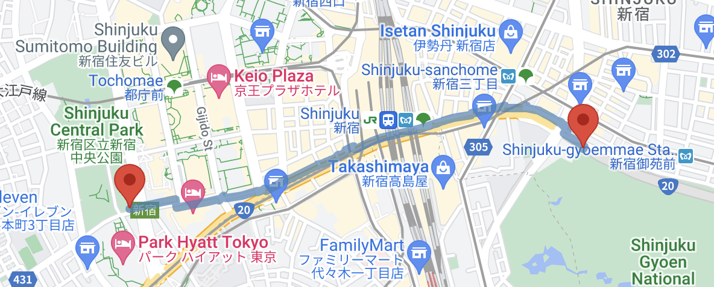
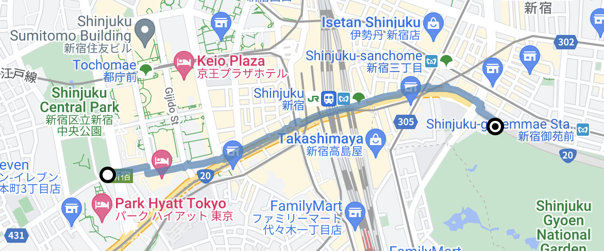

[Extended Component Library](../../../README.md) » [Route Building Blocks](../README.md)

# `<gmpx-route-marker>` (as class `RouteMarker`)

Renders a marker indicating the origin or destination of a route.

> This component is designed to work with a Route Data Provider; please see [Route Building Blocks](../README.md) for more information.

## Importing

When loading the library with a &lt;script&gt; tag (referencing the CDN bundle), please refer to the instructions in the root-level Readme. You do not need to take additional steps to use this component.

When bundling your dependencies and you want to include `<gmpx-route-marker>` on a page:

```
import '@googlemaps/extended-component-library/route_building_blocks/route_marker.js';
```

When bundling your dependencies and you need to access the class `RouteMarker` directly (less common):

```
import { RouteMarker } from '@googlemaps/extended-component-library/route_building_blocks/route_marker.js';
```

## Attributes and properties

| Attribute  | Property             | Property type                      | Description                                                                                                                                                              | Default    | [Reflects?](https://open-wc.org/guides/knowledge/attributes-and-properties/#attribute-and-property-reflection) |
| ---------- | -------------------- | ---------------------------------- | ------------------------------------------------------------------------------------------------------------------------------------------------------------------------ | ---------- | -------------------------------------------------------------------------------------------------------------- |
| `waypoint` | `waypoint`           | `'origin'\|'destination'`          | Which waypoint of the route to position the marker on. For now, this is either "origin" or "destination"; intermediate waypoints are not yet supported.                  | `'origin'` | ✅                                                                                                              |
| `title`    | `title`              | `string`                           | Rollover text for the marker, displayed on mouse hover.                                                                                                                  | `''`       | ✅                                                                                                              |
|            | `zIndex`             | `number \| undefined`              | The z-index of the marker relative to other Advanced Markers.                                                                                                            |            | ❌                                                                                                              |
|            | `innerMarker`        | `AdvancedMarkerElement\|undefined` | The inner `google.maps.marker.AdvancedMarkerElement` from the Maps JS API. This value is set once `innerMarkerPromise` is resolved.                                      |            | ❌                                                                                                              |
|            | `innerMarkerPromise` | `Promise<AdvancedMarkerElement>`   | Resolves to the inner marker when it's ready. It might not be ready immediately becasue the `AdvancedMarkerElement` class is loaded asynchronously from the Maps JS API. |            | ❌                                                                                                              |
|            | `route`              | `DirectionsRoute \| undefined`     | Route data to render, overriding anything provided by context.                                                                                                           |            | ❌                                                                                                              |

## Slots

| Slot name   | Description                                                                                                                                   |
| ----------- | --------------------------------------------------------------------------------------------------------------------------------------------- |
| *(default)* | An element to be used as custom marker content on the map. The element will be detached from the DOM and moved into the map's implementation. |


## Examples

### Use the default marker pin

When the Route Marker has no slotted content, it will appear as the Advanced Marker's default red pin.

```html
<gmp-map map-id="DEMO_MAP_ID">
  <gmpx-route-data-provider
      origin-address="Shinjuku Central Park, Tokyo"
      destination-address="Shinjuku Gyoen, Tokyo"
      travel-mode="walking">
    <gmpx-route-marker waypoint="origin" title="Shinjuku Central Park">
    </gmpx-route-marker>
    <gmpx-route-marker waypoint="destination" title="Shinjuku Gyoen">
    </gmpx-route-marker>
    <gmpx-route-polyline
        stroke-color="steelblue"
        stroke-weight="7"
        stroke-opacity="0.7"
        fit-in-viewport>
    </gmpx-route-polyline>
  </gmpx-route-data-provider>
</gmp-map>
```



### Render custom marker content

When an element is slotted in the route marker, it will be rendered instead of the default pin. 

Note that the element will be detached from the DOM, so its styling must be self-contained as below.

```html
    <gmpx-route-marker waypoint="origin" title="Shinjuku Central Park">
      <div style="
          background-color: white;
          border: 3px solid black;
          border-radius: 10px;
          height: 10px;
          position: relative;
          top: 8px;
          width: 10px;">
      </div>
    </gmpx-route-marker>
    <gmpx-route-marker waypoint="destination" title="Shinjuku Gyoen">
      <svg width="20" height="20" style="position: relative; top: 13px;">
        <circle cx="10" cy="10" r="7" stroke="black" stroke-width="3" fill="white"/>
        <circle cx="10" cy="10" r="1.8" stroke="black" stroke-width="3" fill="black"/>
      </svg>
    </gmpx-route-marker>
```




