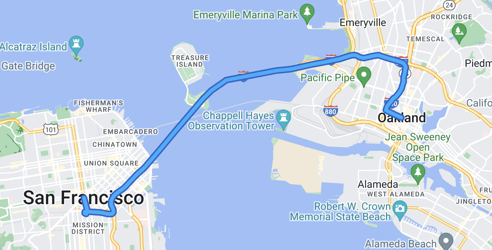

[Extended Component Library](../../../README.md) » [Route Building Blocks](../README.md)

# `<gmpx-route-polyline>` (as class `RoutePolyline`)

Renders a polyline indicating the path of a route.

> This component is designed to work with a Route Data Provider; please see [Route Building Blocks](../README.md) for more information.

## Importing

When loading the library with a &lt;script&gt; tag (referencing the CDN bundle), please refer to the instructions in the root-level Readme. You do not need to take additional steps to use this component.

When bundling your dependencies and you want to include `<gmpx-route-polyline>` on a page:

```
import '@googlemaps/extended-component-library/route_building_blocks/route_polyline.js';
```

When bundling your dependencies and you need to access the class `RoutePolyline` directly (less common):

```
import { RoutePolyline } from '@googlemaps/extended-component-library/route_building_blocks/route_polyline.js';
```

## Attributes and properties

| Attribute         | Property               | Property type                     | Description                                                                                                                                                   | Default | [Reflects?](https://open-wc.org/guides/knowledge/attributes-and-properties/#attribute-and-property-reflection) |
| ----------------- | ---------------------- | --------------------------------- | ------------------------------------------------------------------------------------------------------------------------------------------------------------- | ------- | -------------------------------------------------------------------------------------------------------------- |
| `fit-in-viewport` | `fitInViewport`        | `boolean`                         | Whether or not to automatically adjust the map's viewport to include the polyline.                                                                            | `false` | ✅                                                                                                              |
| `invisible`       | `invisible`            | `boolean`                         | Whether or not the polyline is invisible or visible on the map.                                                                                               | `false` | ✅                                                                                                              |
| `stroke-color`    | `strokeColor`          | `string \| undefined`             | Stroke color of the polyline. All CSS3 colors are supported except for extended named colors.                                                                 |         | ✅                                                                                                              |
| `stroke-opacity`  | `strokeOpacity`        | `number \| undefined`             | The stroke opacity of the polyline between 0.0 and 1.0.                                                                                                       |         | ✅                                                                                                              |
| `stroke-weight`   | `strokeWeight`         | `number \| undefined`             | The stroke width of the polyline in pixels.                                                                                                                   |         | ✅                                                                                                              |
| `z-index`         | `zIndex`               | `number \| undefined`             | The z-index of the polyline compared to other polys.                                                                                                          |         | ✅                                                                                                              |
|                   | `innerPolyline`        | `google.maps.Polyline\|undefined` | The inner `google.maps.Polyline` from the Maps JS API. This value is set once `innerPolylinePromise` is resolved.                                             |         | ❌                                                                                                              |
|                   | `innerPolylinePromise` | `Promise<google.maps.Polyline>`   | Resolves to the inner polyline when it's ready. It might not be ready immediately because the `Polyline` class is loaded asynchronously from the Maps JS API. |         | ❌                                                                                                              |
|                   | `route`                | `DirectionsRoute \| undefined`    | Route data to render, overriding anything provided by context.                                                                                                |         | ❌                                                                                                              |


## Examples

### Draw an outlined route polyline

You can use two Route Polyline components to draw a polyline with an outlined appearance.

```html
<gmp-map center="37.798,-122.344" zoom="12" map-id="DEMO_MAP_ID">
  <gmpx-route-data-provider
      origin-address="San Francisco, CA"
      destination-address="Oakland, CA">
    <gmpx-route-polyline
        stroke-color="#2565cd"
        stroke-weight="9"
        z-index="0"
        fit-in-viewport>
    </gmpx-route-polyline>
    <gmpx-route-polyline
        stroke-color="#1faefb"
        stroke-weight="5"
        z-index="1">
    </gmpx-route-polyline>
  </gmpx-route-data-provider>
</gmp-map>
```




