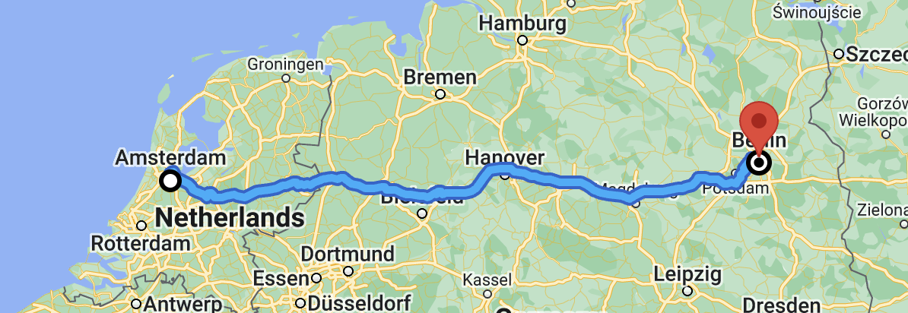

[Extended Component Library](../../README.md)

# `<gmpx-route-overview>` (as class `RouteOverview`)

The route overview component renders a route on a `<gmp-map>` component,
including origin and destination markers, an outlined polyline, and viewport
management.

This component can fetch route data from the Directions API, or use a
`DirectionsRoute` object provided from elsewhere in code. The component will
locally cache route data to avoid redundant API requests.

## Importing

When loading the library with a &lt;script&gt; tag (referencing the CDN bundle), please refer to the instructions in the root-level Readme. You do not need to take additional steps to use this component.

When bundling your dependencies and you want to include `<gmpx-route-overview>` on a page:

```
import '@googlemaps/extended-component-library/route_overview.js';
```

When bundling your dependencies and you need to access the class `RouteOverview` directly (less common):

```
import { RouteOverview } from '@googlemaps/extended-component-library/route_overview.js';
```

## Attributes and properties

| Attribute              | Property             | Property type                        | Description                                                                                                                                                 | Default     | [Reflects?](https://open-wc.org/guides/knowledge/attributes-and-properties/#attribute-and-property-reflection) |
| ---------------------- | -------------------- | ------------------------------------ | ----------------------------------------------------------------------------------------------------------------------------------------------------------- | ----------- | -------------------------------------------------------------------------------------------------------------- |
| `destination-lat-lng`  | `destinationLatLng`  | `LatLng\|LatLngLiteral \| undefined` | The destination of the directions request as a lat/lng. When setting the destination, only one of lat/lng, Place ID, or address should be specified.        |             | ✅                                                                                                              |
| `destination-place-id` | `destinationPlaceId` | `string \| undefined`                | The destination of the directions request as a Place ID. When setting the destination, only one of lat/lng, Place ID, or address should be specified.       |             | ✅                                                                                                              |
| `destination-address`  | `destinationAddress` | `string \| undefined`                | The destination of the directions request as an address query. When setting the destination, only one of lat/lng, Place ID, or address should be specified. |             | ✅                                                                                                              |
| `origin-lat-lng`       | `originLatLng`       | `LatLng\|LatLngLiteral \| undefined` | The origin of the directions request as a lat/lng. When setting the origin, only one of lat/lng, Place ID, or address should be specified.                  |             | ✅                                                                                                              |
| `origin-place-id`      | `originPlaceId`      | `string \| undefined`                | The origin of the directions request as a Place ID. When setting the origin, only one of lat/lng, Place ID, or address should be specified.                 |             | ✅                                                                                                              |
| `origin-address`       | `originAddress`      | `string \| undefined`                | The origin of the directions request as an address query. When setting the origin, only one of lat/lng, Place ID, or address should be specified.           |             | ✅                                                                                                              |
|                        | `route`              | `DirectionsRoute \| undefined`       | Route data to render directly, instead of making an API call.                                                                                               |             | ❌                                                                                                              |
| `travel-mode`          | `travelMode`         | `Lowercase<google.maps.TravelMode>`  | The travel mode of the directions request.                                                                                                                  | `'driving'` | ✅                                                                                                              |
| `no-pin`               | `noPin`              | `boolean`                            | Hides the red pin displayed at the destination.                                                                                                             | `false`     | ✅                                                                                                              |

## Events

| Name                | React Prop       | Type                | Description                                                                    |
| ------------------- | ---------------- | ------------------- | ------------------------------------------------------------------------------ |
| `gmpx-requesterror` | `onRequestError` | `RequestErrorEvent` | Indicates an error condition in an underlying Google Maps JavaScript API call. |


## Examples

### Show a route on a map

To show a driving route between two locations, simply place a Route Overview inside a `<gmp-map>` element with origin and destination attributes set. The Route Overview will automatically set the map's viewport to show the route, so there's no need to set the `center` or `zoom` on the map element.

```html
<gmp-map map-id="DEMO_MAP_ID">
  <gmpx-route-overview origin-address="Amsterdam" destination-address="Berlin">
  </gmpx-route-overview>
</gmp-map>
```



### Use a Place ID, lat/lng coordinates, and custom travel mode

```html
<gmp-map map-id="DEMO_MAP_ID">
  <gmpx-route-overview
      origin-lat-lng="37.77,-122.42"
      destination-place-id="ChIJj61dQgK6j4AR4GeTYWZsKWw"
      travel-mode="transit">
  </gmpx-route-overview>
</gmp-map>
```


## APIs and Pricing

In addition to the [Maps JavaScript API](https://developers.google.com/maps/documentation/javascript?utm_source=github&utm_medium=documentation&utm_campaign=&utm_content=web_components), this component relies on the following Google Maps Platform APIs which may incur cost and must be enabled.

### Directions API

Used when computing a route from the component's origin, destination, and travel mode properties.

#### Documentation

[Directions API documentation](https://developers.google.com/maps/documentation/javascript/directions?utm_source=github&utm_medium=documentation&utm_campaign=&utm_content=web_components). Please be sure to check this documentation for additional requirements and recommendations regarding your use.

#### Pricing

Note that the SKU below is not triggered if you provide a `DirectionsRoute` object for the component to render directly.

- [SKU: Directions](https://developers.google.com/maps/billing-and-pricing/pricing?utm_source=github&utm_medium=documentation&utm_campaign=&utm_content=web_components#directions)


