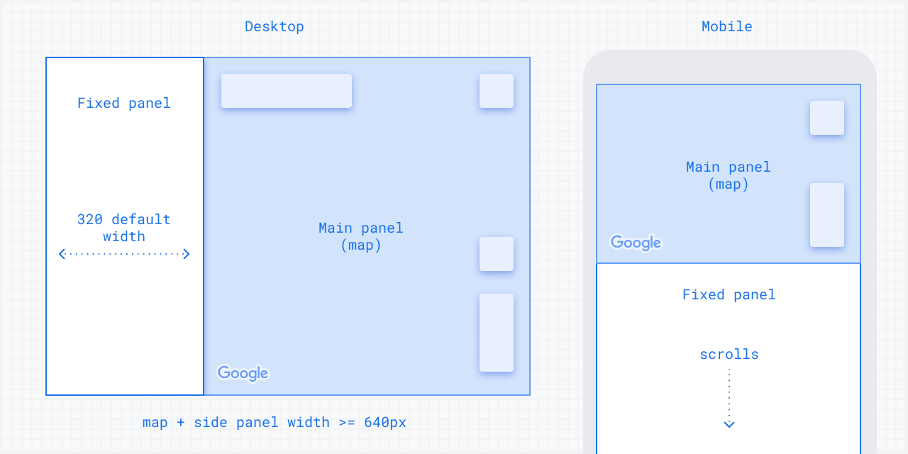

[Extended Component Library](../../README.md)

# Split Layout: `<gmpx-split-layout>` (as class `SplitLayout`)

The split layout component allows you to display custom HTML information in a
responsive panel view alongside main content. In a narrow container, such as
a mobile viewport, the panel will be shown below the main content.



**To use this component, you'll need to specify `slot="main"` or
`slot="fixed"` on its children.** Read more on using slots
[here](https://developer.mozilla.org/en-US/docs/Web/API/Web_components/Using_templates_and_slots#adding_flexibility_with_slots).

## Importing

When loading the library with a &lt;script&gt; tag (referencing the CDN bundle), please refer to the instructions in the root-level Readme. You do not need to take additional steps to use this component.

When bundling your dependencies and you want to include `<gmpx-split-layout>` on a page:

```
import '@googlemaps/extended-component-library/split_layout.js';
```

When bundling your dependencies and you need to access the class `SplitLayout` directly (less common):

```
import { SplitLayout } from '@googlemaps/extended-component-library/split_layout.js';
```

## Attributes and properties

| Attribute              | Property            | Property type | Description                                                                                                                                                                                                                                                    | Default | [Reflects?](https://open-wc.org/guides/knowledge/attributes-and-properties/#attribute-and-property-reflection) |
| ---------------------- | ------------------- | ------------- | -------------------------------------------------------------------------------------------------------------------------------------------------------------------------------------------------------------------------------------------------------------- | ------- | -------------------------------------------------------------------------------------------------------------- |
| `column-reverse`       | `columnReverse`     | `boolean`     | By default, the fixed panel is rendered below the main content when layout is in column direction. If this attribute is specified, then the fixed panel will appear above the main content instead.                                                            | `false` | ✅                                                                                                              |
| `row-layout-min-width` | `rowLayoutMinWidth` | `number`      | When the component’s width in pixels is less than this amount, it displays in a mobile-friendly column layout instead.                                                                                                                                         | `640`   | ✅                                                                                                              |
| `row-reverse`          | `rowReverse`        | `boolean`     | By default, the fixed panel is rendered before the main content when layout is in row direction (left for LTR and vice versa). If this attribute is specified, then the fixed panel will appear after the main content instead (right for LTR and vice versa). | `false` | ✅                                                                                                              |

## Slots

This component uses [named slots](https://developer.mozilla.org/en-US/docs/Web/API/Web_components/Using_templates_and_slots#adding_flexibility_with_slots) to accept custom content. To place content in a named slot, set the content as an HTML child of `<gmpx-split-layout>` and add the attribute `slot="SLOT_NAME"` to it.

| Slot name | Description                                                                                                                                                                                   |
| --------- | --------------------------------------------------------------------------------------------------------------------------------------------------------------------------------------------- |
| main      | Main content.                                                                                                                                                                                 |
| fixed     | Content to be slotted inside the panel with fixed width/height. This panel is displayed on the side of main content when the component has sufficient width, or below main content otherwise. |

## Styling

You can use most built-in CSS properties to control the positioning or display of this component, similar to a `<span>` or `<div>` element. The component also supports the following styling inputs for more customization:

### CSS Custom Properties

| Name                                      | Default | Description                                                                                                                                                 |
| ----------------------------------------- | ------- | ----------------------------------------------------------------------------------------------------------------------------------------------------------- |
| `--gmpx-fixed-panel-width-row-layout`     | `320px` | Controls the fixed panel width when the component is displayed in row direction. Main content width will adjust automatically to fill remaining space.      |
| `--gmpx-fixed-panel-height-column-layout` | `50%`   | Controls the fixed panel height when the component is displayed in column direction. Main content height will adjust automatically to fill remaining space. |


## Examples

### Full page map and side panel

Split Layout is a good way to show a map next to conditional content. This example shows how the layout accommodates a map (main panel) and a Place Overview (fixed panel):

```html
<gmpx-split-layout>
  <gmp-map slot="main" center="-25.344,131.031" zoom="4" map-id="DEMO_MAP_ID">
    <gmp-advanced-marker position="-25.344,131.031"></gmp-advanced-marker>
  </gmp-map>
  <div slot="fixed">
    <h3>More information</h3>
    <gmpx-place-overview place="ChIJI1JibStsIysRIV_Fm03NqEM"></gmpx-place-overview>
  </div>
</gmpx-split-layout>
```

The `<gmpx-split-layout>` element, by default, will attempt to fill the height of its container. To make the above example fill the whole screen, place it directly inside the `<body>` tag, and make sure to include the following CSS:

```css
html, body {
  height: 100%;
  margin: 0;
}
```


